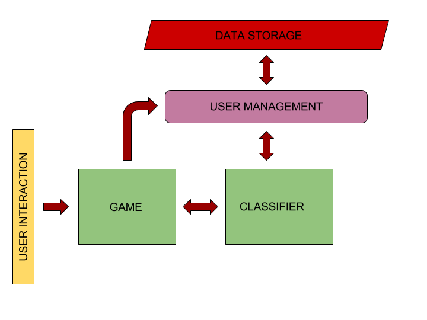

VIP-BCI Component Description
=============================

The application structure is really simple and can be generalized as a classifing service coupled with an interactive user interface. Given that the classifier is trained with a different data set according to the user, a user management entity should be implemented, so that the correct data files are loaded when training. The interaction section is logically independant from the core section of classification, the main link is a set of functions that are:

::
    receiveClassifierDecision()
    move(decision)

The first function links the game and the classifier, retreiving the decision, 0 or 1, as the decision is binary. The second function implements the movement according to the specific game. In this manner both, display and logic are separated. A system that implements such a structure is shown in Figure 1.

   Figure 1. Components of the application