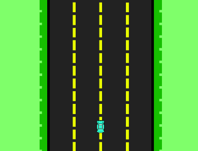

VIP-BCI Code Explorer
=====================

This Code Explorer is distributed in sections, each section corresponds to a game type; only relatively relevant functions are explained, the way they interact with other functions is also specified.

Car Game
--------
The car game is shown in Figure 1. It is supposed to allow horizontal movements to right and left.

   Figure 1. Components of the application

The entry point of the application is through a class named `App` and is composed as follows. The code is ilustrative and minimized, actual code is much larger.

::

    App():
        def __init__(ID=nombre, trials=n, fps=60, **args):
            # Init UI components
            # Init thread instances
            ...

        def run():
            # Main loop of the application
            # the self.fps variable controls the speed of the motion
            ...

        def training():
            # Init the retreiving data cycle
            ...

        def game():
            # Init the game instance, start classification thread to guess the car
            # direction
            ...

        def draw_text():
            # display notification message
            ...

        def getData():
            # Check if the Starstim device is available
            # Start buffering data
            # This is executed in a separated thread
            # This runs in the training mode
            ...

        def AutoUpdateBuffer():
            # Check if the Starstim device is available
            # Start buffering data
            # This is executed in a separated thread
            # This runs in the game mode
            ...

        def saveData(ID):
            # Stores the retreived data
            ...

        def processing():
            # Transforms the retreived data to a format that can be analyzed
            ...

As can be seen, the `App` class is self contained, as it implements functions of both classification and game interaction. In the following, the functions will be explained in detail.

